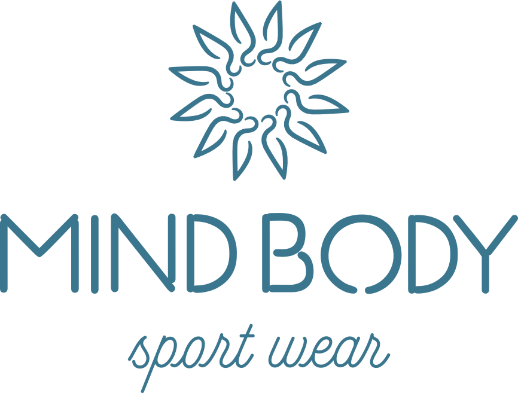

# MIND BODY Sportwear — Ecommerce Website



## 🌟 О проекте

Современный ecommerce сайт для украинского бренда спортивной одежды **MIND BODY**, специализирующегося на одежде для йоги, гимнастики, акробатики и осознанного движения для женщин и детей.

## 🎨 Концепция дизайна

### Позиционирование
- **Сегмент**: Mid-range premium
- **Целевая аудитория**: Женщины и дети, практикующие йогу, гимнастику, акробатику
- **Настроение**: Элегантный но сильный, спокойный но динамичный, женственный + атлетичный

### Визуальная идентичность
- **Основной цвет**: Teal Ocean (#3D7A8C) — символ гармонии и баланса
- **Акцентные цвета**: Deep Purple (#4B3B6B), Royal Blue (#1E3A8A)
- **Фоновые цвета**: Cream (#F8F5F0), Soft Cream (#EDE9E3)
- **Графические мотивы**: Мандала-паттерны, символ солнца-людей
- **Типографика**: Josefin Sans (заголовки), Pacifico (акценты), Inter (текст)

## 📁 Структура проекта

```
mindbody/
├── index.html              # Главная страница
├── pics/                   # Изображения бренда
│   ├── mind_body_logo.png
│   ├── mind_body_logo_sun.png
│   └── ...
├── src/
│   ├── css/
│   │   ├── variables.css   # Дизайн-система (цвета, шрифты, spacing)
│   │   ├── base.css        # Базовые стили и reset
│   │   ├── components.css  # UI компоненты (кнопки, карточки)
│   │   ├── layout.css      # Лейауты секций
│   │   └── animations.css  # Анимации и эффекты
│   └── js/
│       └── main.js         # Основной JavaScript
└── README.md
```

## 🚀 Запуск проекта

### Вариант 1: Прямое открытие
Просто откройте файл `index.html` в браузере (двойной клик или правой кнопкой → Открыть с помощью → Браузер)

### Вариант 2: Локальный сервер (рекомендуется)

**С помощью Python:**
```bash
# Python 3
python -m http.server 8000

# Откройте http://localhost:8000
```

**С помощью Node.js (http-server):**
```bash
npx http-server -p 8000

# Откройте http://localhost:8000
```

**С помощью VS Code:**
Установите расширение "Live Server" и нажмите "Go Live"

## 📄 Страницы сайта

### Реализовано:
- ✅ **Главная страница** (index.html)
  - Hero секция с анимацией
  - Категории товаров
  - Новые поступления
  - Ценности бренда
  - Lookbook превью
  - О бренде
  - Instagram лента
  - Newsletter подписка
  - Footer

### Запланировано для разработки:
- 📋 Женщинам (каталог)
- 📋 Детям (каталог)
- 📋 Коллекции
- 📋 Страница товара
- 📋 Lookbook
- 📋 О бренде (полная)
- 📋 Sustainability
- 📋 Контакты
- 📋 Корзина
- 📋 Checkout

## 🎯 Ключевые особенности

### Дизайн
- ✨ Cinematic hero секции с градиентами
- 📖 Editorial layouts с журнальной версткой
- 🎨 Сильная типографика
- 🌬️ Воздушные композиции с negative space
- 🎭 Мандала-паттерны как декоративные элементы

### Анимации
- 🔄 Scroll reveal эффекты
- ⚡ Micro-interactions на кнопках и карточках
- 🌊 Плавные переходы
- 💫 Hover эффекты с transform и shadow
- 🎪 Анимация прелоадера с вращением логотипа

### UX/UI
- 📱 Mobile-first responsive дизайн
- ♿ Accessibility (ARIA labels, focus states)
- 🎯 Четкие CTA кнопки
- 💚 Wishlist функционал
- 🛒 Добавление в корзину с анимацией
- 📧 Newsletter форма с валидацией

## 🎨 Дизайн-система

### Цветовая палитра
```css
--color-primary: #3D7A8C;        /* Teal Ocean */
--color-primary-dark: #2A5A68;   /* Deep Teal */
--color-accent: #4B3B6B;         /* Deep Purple */
--color-bg-cream: #F8F5F0;       /* Cream */
--color-text-primary: #2D2D2D;   /* Charcoal */
```

### Типографическая шкала
```css
--text-6xl: 4.5rem;  /* 72px - Hero заголовки */
--text-4xl: 3rem;    /* 48px - Секции */
--text-2xl: 1.5rem;  /* 24px - Подзаголовки */
--text-base: 1rem;   /* 16px - Основной текст */
```

### Spacing система (8px base)
```css
--space-sm: 8px;
--space-md: 16px;
--space-lg: 24px;
--space-xl: 32px;
--space-2xl: 48px;
--space-3xl: 64px;
--space-4xl: 96px;
--space-section: 120px;
```

## 🔧 Технологии

- **HTML5** — семантическая разметка
- **CSS3** — CSS Variables, Flexbox, Grid
- **Vanilla JavaScript** — без фреймворков
- **Google Fonts** — Josefin Sans, Pacifico, Inter
- **Intersection Observer API** — scroll reveal анимации

## 📱 Responsive Breakpoints

```css
--breakpoint-sm: 640px;   /* Mobile landscape */
--breakpoint-md: 768px;   /* Tablet */
--breakpoint-lg: 1024px;  /* Desktop */
--breakpoint-xl: 1280px;  /* Wide desktop */
```

## 🎭 Брендовые ценности

1. **Made with soul** — Зроблено з душею
2. **Pleasant to touch** — Приємно до дотику
3. **Breathable** — Дихаючі матеріали
4. **Eco-friendly** — Екологічні матеріали
5. **4-WAY stretch** — Еластичність у всіх напрямках
6. **High quality sewing** — Якісний крій

## 📊 Производительность

### Оптимизации:
- ✅ Минимальные зависимости (только Google Fonts)
- ✅ CSS Variables для быстрых изменений темы
- ✅ Debounce/Throttle для scroll событий
- ✅ Intersection Observer вместо scroll listeners
- ✅ Preload критических ресурсов

### Рекомендации для продакшена:
- [ ] Минификация CSS/JS
- [ ] Оптимизация изображений (WebP, lazy loading)
- [ ] CDN для статических ресурсов
- [ ] Gzip/Brotli компрессия
- [ ] Service Worker для offline режима

## 🌐 SEO

Реализовано:
- ✅ Семантический HTML5
- ✅ Meta теги (title, description)
- ✅ Open Graph теги (готово к добавлению)
- ✅ Структурированная разметка заголовков (H1-H6)
- ✅ Alt теги для изображений
- ✅ Уникальные ID для элементов

## 🔮 Следующие шаги

### Фаза 2: Каталог и продукты
1. Создать страницы каталогов (Женщинам, Детям)
2. Реализовать фильтры и сортировку
3. Создать детальную страницу товара
4. Добавить галерею изображений с zoom
5. Реализовать выбор размера/цвета

### Фаза 3: Ecommerce функционал
1. Корзина с локальным хранилищем
2. Checkout процесс
3. Интеграция с Новой Поштой API
4. Платежные системы (LiqPay, Приват24)
5. Личный кабинет пользователя

### Фаза 4: CMS интеграция
1. Backend (Node.js/PHP)
2. База данных (MongoDB/MySQL)
3. Админ-панель для управления товарами
4. Система заказов
5. Email уведомления

### Фаза 5: Дополнительные фичи
1. Wishlist с сохранением
2. Сравнение товаров
3. Отзывы и рейтинги
4. Программа лояльности
5. Блог/Статьи

## 📞 Контакты

- **Website**: mind-body.com.ua
- **Instagram**: @mindbody_sportwear
- **Facebook**: @mindbody_sportwear
- **Email**: info@mind-body.com.ua

## 📝 Лицензия

© 2026 MIND BODY. Все права защищены.

---

**Motivate for active life** 🧘‍♀️✨
